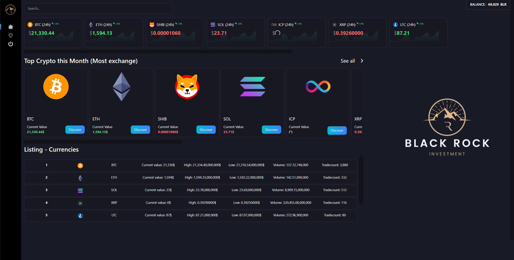

# :chart_with_upwards_trend: CryptoCharts — Real-Time Cryptocurrency Dashboard

[](https://github.com/Senzo13/CryptoCharts/stargazers)
[](https://github.com/Senzo13/CryptoCharts/network/members)
[](https://opensource.org/licenses/ISC)
[](https://www.typescriptlang.org/)
[](https://reactjs.org/)

A full-stack **cryptocurrency dashboard** that displays **real-time price data**, interactive charts, and market listings for Bitcoin, Ethereum, Solana, and other popular digital assets. Built with React, TypeScript, and WebSockets for live updates.

<div align="center">
  
</div>

---

## :sparkles: Features

- **Live Price Ticker** — Real-time cryptocurrency prices with 24h change indicators for BTC, ETH, SOL, SHIB, XRP, LTC, and more
- **Interactive Charts** — Powered by ApexCharts for detailed price visualization and trading analysis
- **Market Listings** — Comprehensive table with current value, high/low, volume, and trade count
- **Top Cryptocurrencies** — Highlights the most exchanged crypto assets of the month
- **WebSocket Streaming** — Instant price updates without page refresh via WebSocket connections
- **RSS Feed Integration** — Aggregated crypto news and market data from RSS sources
- **User Authentication** — Secure sign-up/login with password hashing (bcrypt) and JWT tokens
- **Email Notifications** — SMTP-based email system with HTML templates (Handlebars)
- **Search Functionality** — Quickly find any cryptocurrency in the dashboard
- **Responsive Design** — Clean, dark-themed UI built with Tailwind CSS

---

## :wrench: Tech Stack

| Layer        | Technology                                                     |
| ------------ | -------------------------------------------------------------- |
| **Frontend** | React 18, TypeScript, Tailwind CSS, ApexCharts, Axios          |
| **Backend**  | Node.js, Express, TypeScript, WebSocket (ws), Socket.IO        |
| **Database** | MongoDB Atlas (Mongoose ODM)                                   |
| **Auth**     | JWT (jose), bcrypt, Firebase Admin                             |
| **Email**    | Nodemailer, Handlebars templates                               |
| **Testing**  | Jest, React Testing Library, Supertest                         |
| **DevOps**   | Docker, GitLab CI/CD, ESLint, Prettier                        |

---

## :rocket: Getting Started

### Prerequisites

- **Node.js** >= 16
- **npm** or **yarn**
- **MongoDB Atlas** account (or a local MongoDB instance)

### Installation

1. **Clone the repository**

   ```bash
   git clone https://github.com/Senzo13/CryptoCharts.git
   cd CryptoCharts
   ```

2. **Set up the backend**

   ```bash
   cd backend
   npm install
   ```

   Create a `.env` file in the `backend/` directory with your MongoDB connection string and other required environment variables.

3. **Set up the frontend**

   ```bash
   cd frontend
   npm install
   ```

4. **Run the backend**

   ```bash
   cd backend
   npm start
   ```

5. **Run the frontend**

   ```bash
   cd frontend
   npm start
   ```

   The app will open at `http://localhost:3000`.

### Docker (Backend)

```bash
cd backend
npm run docker:build
npm run docker:start
```

---

## :test_tube: Running Tests

```bash
# Backend unit tests
cd backend
npm run test

# Backend tests with coverage
npm run test:coverage

# Frontend tests with coverage
cd frontend
npm run test:coverage
```

---

## :building_construction: Project Structure

```
CryptoCharts/
├── backend/             # Express API server
│   ├── src/
│   │   ├── controllers/ # Route controllers (auth, healthcheck)
│   │   ├── models/      # Mongoose models (User, Cryptocurrency)
│   │   ├── services/    # Business logic (crypto, user services)
│   │   ├── utils/       # Auth helpers, SMTP utilities
│   │   └── config/      # Database configuration
│   ├── __tests__/       # Jest test suites
│   └── Dockerfile
├── frontend/            # React SPA
│   ├── src/
│   │   ├── assets/      # Images and icons
│   │   └── ...          # Components, pages, hooks
│   └── public/
└── README.md
```

---

## :handshake: Contributing

Contributions are welcome! Here is how you can help:

1. Fork the repository
2. Create a feature branch (`git checkout -b feature/your-feature`)
3. Commit your changes (`git commit -m "Add your feature"`)
4. Push to the branch (`git push origin feature/your-feature`)
5. Open a Pull Request

---

## :page_facing_up: License

This project is licensed under the [ISC License](https://opensource.org/licenses/ISC).

---

## :bust_in_silhouette: Author

**Lorenzo Giralt** — [@Senzo13](https://github.com/Senzo13)

---

> If you found this project useful, consider giving it a :star: on GitHub!
